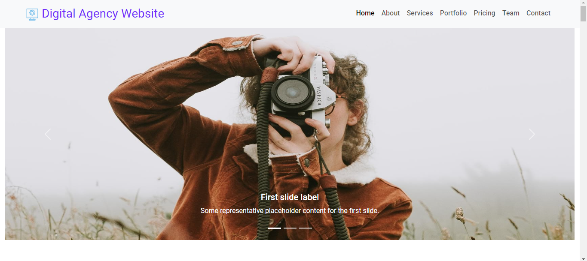
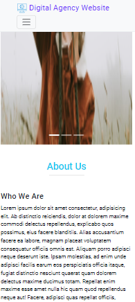

<div align="center">
  <h2 align="center">Digital Agency Website</h2>

  It is a fully responsive digital agency website, <br />Responsive for all devices, built using HTML, CSS and Bootstrap.

  ## <a href="https://mominurr.github.io/agency-website"><strong>➥ Run a Live Demo Of This Project </strong></a>

</div>

<br />

### Demo Screenshots

<div background-color="red" >

<br/>

</div>


### Prerequisites

Before you begin, ensure you have met the following requirements:

* [Git](https://git-scm.com/downloads "Download Git") must be installed on your operating system.

### Run Locally

To run **Digital Agency Website** locally, run this command on your git bash:

Linux and macOS:

```bash
sudo git clone https://github.com/mominurr/agency-website.git
```

Windows:

```bash
git clone https://github.com/mominurr/agency-website.git
```

### <a href="https://mominurr.github.io/agency-website"><strong>➥ Live Demo</strong></a>

### Contact or Connect with me:

If you want to contact with me you can reach me:

[Twitter](https://twitter.com/mominur_rahma_n)

[Linkedin](https://www.linkedin.com/in/mominur-rahman-145461203/)

[Facebook](https://www.facebook.com/mominurr518)

[Website](https://mominur.dev/)


### License

This project is **free to use** and does not contains any license. Once again most intellectual property right is refrenced on the credit section above

 